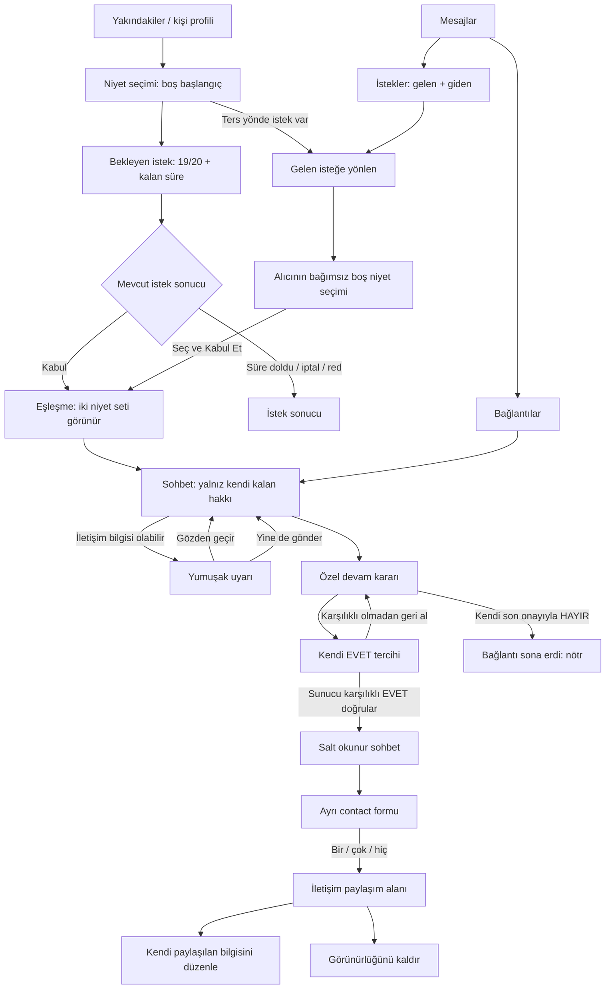

# 00 — Paket 3 akış haritası

Çizim yönlendirme mantığını anlatır; sunucu işlemi veya otomatik seçim değildir. Her ok gerçek işlem sonucu ve mevcut erişim kontrolüne bağlıdır. Alıcının niyetleri kabul öncesinde bağımsızdır. Karşı tarafın devam kararı hiçbir ayrı düğüm/rozet olarak UI'a açılmaz; şemadaki karşılıklı koşul backend'in yetki verdiği sonuçtur.

Erişim kaldırılmış/engellenmiş içerik için tüm rotalarda nötr kullanılamıyor görünümü üstündür. Kapalı sohbet, ancak mevcut erişim/saklama koşulları izin verdiği sürece salt okunur gösterilir. “Sohbete dön” eski sohbeti yeniden açmaz.
