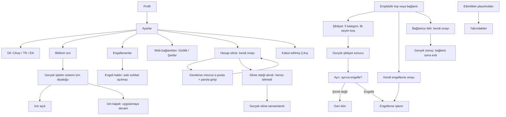

# 00 — Akış ve giriş noktaları

Şema sırayı anlatır; her silme mutlaka gecikmeli çalışır veya yeniden giriş ister diye bir kural getirmez. Mevcut backend doğrudan tamamlanma döndürebilir; ara durum yalnız gerçekse gösterilir. Reauth başarısı tek başına silme değildir; kendi onayına geri dönülür. Sonucu belirsiz işlem önce mevcut işlem kimliğiyle uzlaştırılır.

Güvenlik menüsünün bağlantıyı bitir satırı yalnız mevcut bağlantı bağlamında vardır. Keşifteki bağlantısız profil için yalnız report/block sunulur. İşlem hedefi kişi/bağlantı sabit kimliğiyle taşınır; görünen ad işlem anahtarı değildir. Profil alanlarının görünürlük kuralları değişmez.

4 sekme sırası Profil → Mesajlar → Yakındakiler → Etkinlikler; başlangıç Yakındakiler. Ayarlar yeni ana sekme değildir. İşlem ekranı geçici tam sayfa/sheet olarak açılır; eski bağlam ve geri odağı korunur.
