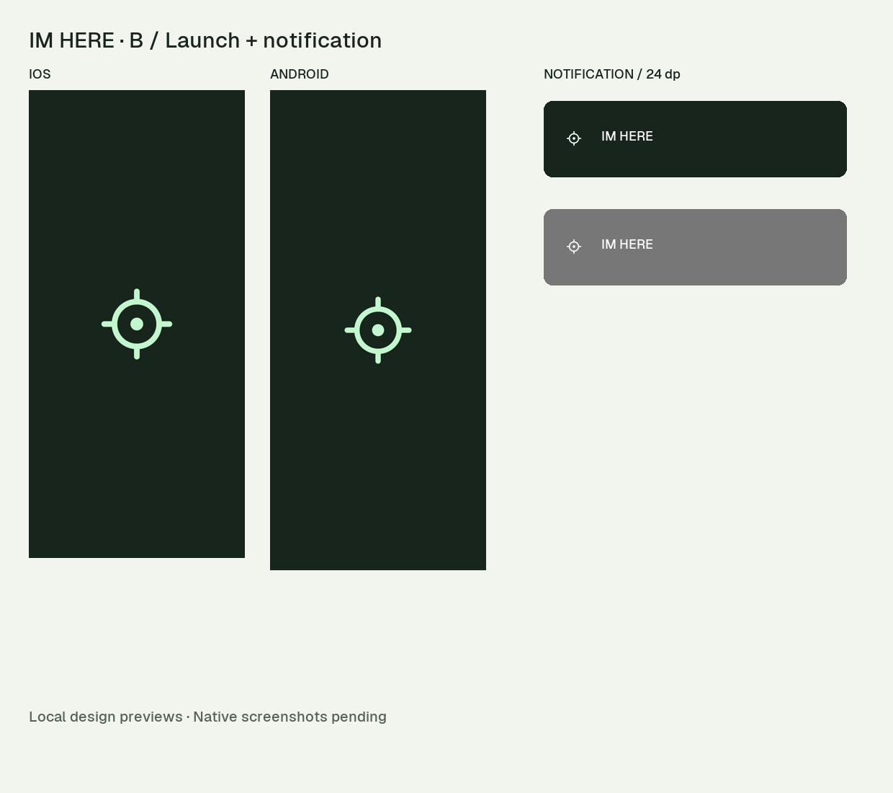

# IM HERE — A4 devam teslimi v1.0

B-symbol Founder tarafından seçildi; A uygulanmayacak. Bu teslim B ile uyumlu resmî bildirim küçük simgesi, yerel açılış ekranı tasarımı ve koyu OpenFreeMap/MapLibre stilini içerir. Yeni dosyalar tasarım teslimidir; native uygulamaya uygulanmadı.

## Dosya haritası
- `notification/`: resmî küçük simge SVG, Android VectorDrawable XML ve 24/36/48/72/96 px PNG.
- `splash/`: açılış işareti SVG, 288/576/864 PNG, iOS/Android yerleşim çizimleri.
- `map/imhere-forest-night-en.json`: aktif İngilizce MapLibre v8 alt harita stili.
- `map/imhere-forest-night-tr.json`: Türkçe yeniden açıldığında hazır karşılığı.
- `map/integration.json`: renk katmanı ve attribution bağlantı notları.
- `review/`: yerleşim, simge ve gerçek harita döşemesiyle tarayıcı önizlemeleri.
- `KARAR-KAPANISLARI.md`: açık görünen soru bloklarının yanıtları.

## İnceleme

[İngilizce koyu harita önizlemesi](review/map-en.png) · [Türkçe harita önizlemesi](review/map-tr.png)

Harita interaktif önizlemesi `map/PREVIEW.html` içindedir. Yerel bir HTTP sunucusuyla açılır; tile/glyph erişimi için internet gerekir. Bu tanıtım/ürün sitesi değildir. Konum izni istemez, GPS kullanmaz, kişi veya etkinlik verisi içermez.

## Durum
B seçimi onaylıdır. Code'un türettiği küçük simge görseli bu tasarım turunda görülmedi; ona görsel onay verilmedi. Bunun yerine burada resmî küçük simge teslim edildi. Uygulanan sonuç Founder üzerinden iletilecek simülatör/emülatör ve cihaz görüntüleriyle karşılaştırılacak. Yeni splash ve harita dosyaları teslim edildi; native entegrasyon testi henüz yapılmadı.
