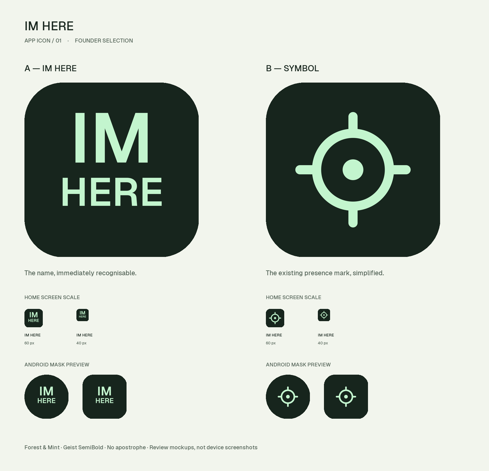

# ESKİ — kullanma

Bu paketteki A-wordmark ve B-symbol güncel simge değildir. [Güncel Google Play simgesi](../../03-MAGAZA/imhere-store-v1.0/google-play/app-icon-512.png) kullanılmalıdır. Aşağıdaki içerik önceki teslimin tarihsel kaydıdır.

---

# IM HERE — Uygulama simgesi v1.0

**Durum: Founder B-symbol seçti; A uygulanmayacak.** Telefon altında görünen uygulama adı: **IM HERE**. Kesme işareti yok; tüm harfler büyük. İsim ve B-symbol seçimi onaylıdır.

## A — Yazılı
`A-wordmark/`: iki satırda IM HERE. Geist SemiBold harfleri vektör çizgilere dönüştürüldü; SVG açılırken font kurulumuna ihtiyaç yok. Harf biçimleri değiştirilmedi. Forest & Mint temasının koyu yüzeyi ve açık mint rengi.

## B — Yazısız
`B-symbol/`: v1.3 marka referansındaki halka, merkez noktası ve dört kısa çizgi korunarak küçük boyutta okunabilecek kalınlıkta çizildi. Yeni bir harita kullanıcı işareti değildir; yalnız uygulama simgesidir.

**Tasarımcı tercihi: B.** Küçük boyutta daha kolay ayırt ediliyor; uygulama adı zaten işletim sisteminin simge altındaki etiketinde IM HERE olarak görünecek. Founder B-symbol seçimini yaptı.

## Dosyalar
Her seçenek altında:
- `icon-master.svg`: düzenlenebilir vektör, 1024 kare, köşeler dosyada kesilmemiştir.
- `icon-1024.png`: opak RGB ana raster; iOS yüksek çözünürlüklü kaynak.
- `icon-512.png`, `icon-192.png`, `icon-180.png`, `icon-120.png`, `icon-60.png`, `icon-40.png`: inceleme/aktarım için raster boyutları.
- `artwork-layer.svg`: yalnız öndeki şekil/yazı; şeffaf zemin.
- `android-foreground.svg` ve `android-foreground-1024.png`: adaptif simge için ayrı şeffaf ön katman, güvenli alan içine küçültülmüş.
- `android-background.svg` ve `android-background-1024.png`: tam dolu arka katman.
- `android-composite-preview.svg/png`: iki katmanın birleşik inceleme görünümü; foreground yerine kullanılmaz.

Android katmanları aynı kare üzerinde üst üste getirilir; ön katmana yeniden otomatik kırpma/büyütme yapılmaz. Görsel maskeler yalnız karşılaştırma panosundadır. Final sistem maskesini platform uygular. Bunlar seçime hazır tasarım kaynaklarıdır; derlenmiş iOS asset catalog veya Android resource paketi değildir. Seçim sonrası yazılım tarafı ilgili platform varlıklarına bağlar ve gerçek cihazda doğrular. Otomatik dark/tinted görünümlerin veya Icon Composer materyallerinin cihazda test edildiği iddia edilmez.

## Kontrol
İki seçenekte 1024×1024 opak ana PNG, font bağımsız SVG, küçük boyutlar ve Android güvenli alan kontrol edildi. A/B karşılaştırması görsel olarak incelendi. Panodaki telefon ölçeği ve maske örnekleri tasarım önizlemesidir, cihaz ekran görüntüsü değildir.

## Kapsam
Yalnız uygulama simgesi. Yerel açılış ekranı, bildirim küçük simgesi ve koyu harita bu teslimde tamamlanmış sayılmaz. Android adaptif ön katmanı bildirim küçük simgesi değildir. Eski dosyalardaki I'M HERE yazıları arşiv olarak korunur; bu teslim telefondaki uygulama adı kararını ve yeni simge adaylarını kapsar. Önceki tema tokenları değişmez.

## Teknik kaynaklar
- [Apple — App icon asset catalog](https://developer.apple.com/documentation/xcode/configuring-your-app-icon)
- [Android — Adaptive icons](https://developer.android.com/develop/ui/compose/system/icon_design_adaptive)

Bu kaynaklar platform aktarımına referanstır; tasarım dosyalarının mağazada otomatik kabulünü garanti etmez.
